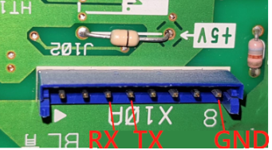

# AlthermaInterface

ESP32 firmware that reads a **Daikin Altherma** heat pump over its X10A service
connector and publishes every value to MQTT / Home Assistant — built on
**ESP-IDF v6.x**, no Arduino framework and no PlatformIO.

Status: **v1.0.0, running on a real machine.** Verified against a Daikin Altherma
LT split hydrobox (EKHBH/EKHBX 008BA, protocol S) — the X10A link has run for
hours with zero CRC errors, and the values reach Home Assistant with no YAML.

## What it does

- **Reads the X10A service port** — 9600 8E1, Daikin protocol **S** and **I**,
  CRC-checked, with the per-model value definitions from upstream.
- **Publishes to MQTT** in upstream ESPAltherma's exact payload format, so an
  existing Home Assistant setup needs no reconfiguration.
- **Home Assistant discovery** — entities appear automatically, with device
  classes and long-term statistics.
- **On-device web UI** — measurements, link diagnostics, configuration and OTA:
  - *Daikin Data* — every decoded value, refreshed live
  - *Debug* — X10A link health per registry, WiFi, MQTT activity counters, device
  - *Config* — WiFi (scan and pick a network), MQTT broker, X10A pins, repo
  - *OTA* — upload a `.bin`, or flash a GitHub release the device downloads itself
- **WiFi provisioning** — with nothing configured it raises an open access point
  named `AlthermaInterface` at `192.168.4.1` so the network can be chosen from a
  browser. Static IP supported, for routers that associate a client but never
  answer its DHCP request.
- **OTA with rollback** — dual app slots; an image that fails to boot is reverted
  automatically, so a bad upload cannot brick a unit sealed inside a heat pump.

**Read-only by design.** It publishes and never subscribes, and drives no GPIO,
so it cannot command the heat pump. See `FSD_AlthermaInterface.md` §2.

## A find, for anyone else on protocol S

A scan of all 256 registry IDs on this machine turned up **registry `0x5A`**,
which appears in no upstream definition file and in no published documentation.
Correlating it against a live heating cycle and a DHW cycle showed it is the
**raw ADC readout** of the sensors `0x54` reports converted:

| offset | channel | r |
|---|---|---|
| 0 | zero reference | — |
| 2 | DHW tank | −0.992 |
| 4 | inlet water | −0.999 |
| 6 | refrigerant liquid side | −1.000 |
| 8 | water circuit, unassigned | — |
| 10 | outlet water | −0.999 |
| 12 | unconnected input | — |
| 14 | full-scale reference (1020) | — |

Every channel moves *inversely* to its temperature — the NTC signature — and the
block is bracketed by a zero and a 10-bit full-scale reference. Offset 12 was
tested against temperature, outdoor air and power consumption and excluded from
all three; it reads as an unconnected input.

Its value is diagnostic: a sensor drifting toward either rail, or open-circuit at
full scale, shows here before the conversion in `0x54` hides it.

Full method, correlation tables and raw captures in
[`docs/REGISTER_0x5A.md`](docs/REGISTER_0x5A.md).

`0x53`, the boolean register, is documented upstream but only partly verified.
On this machine **payload offset 3 is confirmed as the electric heater
contactor** — heard engaging three times while three concurrent captures caught
the byte flipping — so upstream's `External heater?` loses its question mark.
That bit is worth having in Home Assistant: resistive backup heat is the
expensive operating mode.

**Telling DHW from space heating** is `0x53` offset 5,
`Priority to domestic water` — confirmed by stopping the room thermostat to get
an all-zero baseline, forcing a DHW call, and *watching the 3-way valve divert*
as the bit went 0 → 1.

Note what does **not** work: `Operation Mode` reads `Heating` continuously —
through a full DHW cycle and even while the machine sits idle with the pump off.
It is the configured season, not a running state. Tank temperature also lags,
and *falls* during the first minutes of a cycle. See
[`docs/REGISTER_0x53.md`](docs/REGISTER_0x53.md).

## Credit — this is a derivative of ESPAltherma

The X10A protocol work, the registry/value conversion logic and the ~40 heat
pump definition files that make this possible are **not** original to this
project. They come from:

> **[raomin/ESPAltherma](https://github.com/raomin/ESPAltherma)** — © 2020 Raomin, MIT licensed.

That repository is the input to this one. Its protocol documentation
(`doc/Daikin I protocol.md`, `doc/Daikin S protocol.md`), its per-model value
definitions (`include/def/*.h`) and its converter table (`include/converters.h`)
are reused here with attribution; if you want the mature, widely-deployed,
Arduino/PlatformIO version — **use theirs**, not this one.

This project exists only to move that work onto native ESP-IDF, to match the
rest of this author's ESP32 firmware (see the sibling BirdBox project) and to
gain runtime configuration, a web UI and OTA with rollback.

Upstream reference clone (git-ignored, not part of this repo):

```sh
git clone https://github.com/raomin/ESPAltherma.git upstream-ESPAltherma
```

Pinned at upstream commit `4e518ec` (2026-07-24) for this port.

## Why ESP-IDF instead of the Arduino original

| | upstream ESPAltherma | AlthermaInterface |
|---|---|---|
| Framework | Arduino + PlatformIO | ESP-IDF v6.0.1, CMake |
| Config | compile-time `src/setup.h`, reflash to change | NVS + web UI, no reflash |
| MQTT | PubSubClient | esp-mqtt (native, TLS via cert bundle) |
| OTA | ArduinoOTA | HTTPS/web OTA, dual slots + auto rollback |
| Loop | single `loop()`, `delay()` everywhere | FreeRTOS tasks, no blocking spin |

## Hardware

An ESP32 wired to the heat pump's **X10A** service connector, on the main PCB of
the indoor unit or monobloc. Four wires: 5 V, GND, and the two data lines.

Turn the heat pump off at the breaker before opening the panel.

### 5 pin X10A connection

The common Daikin Altherma connector:

| X10A | ESP32 |
|---|---|
| 1-5V | `5V` / `VIN` — can power the ESP |
| 2-TX | **RX pin** — default `GPIO16`. Prefer your board's RX2. |
| 3-RX | **TX pin** — default `GPIO15`. Prefer your board's TX2. |
| 4-NC | not connected |
| 5-GND | `GND` |

**The data lines cross.** The labels are the heat pump's, so its TX is your RX.
Upstream defaults TX to GPIO17; this firmware uses GPIO15, and both pins are
configurable — see below.

If your installation has a bi-zone module, X10A is occupied by it; connect to
**X12A** on the bi-zone module instead, which has identical pins.

### 8 pin X10A connection

Some heat pumps (ROTEX) have an X10A port that connects differently:



*Photo from [raomin/ESPAltherma](https://github.com/raomin/ESPAltherma), annotated.*

Counting from the left in the picture:

| X10A | ESP32 |
|---|---|
| 1-5V | `5V` / `VIN` — can power the ESP |
| 3-RX | **TX pin** — default `GPIO15` |
| 4-TX | **RX pin** — default `GPIO16` |
| 8-GND | `GND` |

Pins 2, 5, 6 and 7 are not used. Note the order: **RX comes before TX** here,
the reverse of the 5-pin connector above, so the two data wires land on
different pins than you might expect. Go by the printed labels, not by position.

Some users report the 5 V from a ROTEX is not strong enough to run an
ESP32/ESP8266 — in that case power the board from a USB charger and leave the
X10A 5 V unconnected.

**Whatever you do, keep a wire from the ESP's GND to the X10A GND pin — even
when powering the board from a USB charger.**

### When it does not work

Getting the data lines backwards produces *silence*, not an error — every
registry simply times out with zero bytes. The **Debug** tab reports the RX
line's idle level sampled at boot: an idle transmitter holds its line **high**,
so `idle LOW (not driven?)` means the receive wire is not on the pump's TX pin.
That one line distinguishes a wiring fault from a protocol or definition
problem.

### Configurable pins

The defaults are `GPIO16` / `GPIO15`, but **both are settable at runtime** from
**Config → X10A pins**, stored in NVS — no rebuild needed to move them. This
matters if your board has those pins committed elsewhere, or the wiring is
already made up.

Values are validated before they are accepted:

- must be `0`–`39`, and RX and TX must differ
- **`GPIO6`–`GPIO11` are refused** — they are the SPI flash bus, and using one
  would stop the chip booting rather than merely failing
- **`GPIO34`–`GPIO39` are refused for TX** — input-only on the ESP32, no output
  driver
- a stored pair that somehow fails validation is discarded at boot in favour of
  the compile-time defaults

A wrong-but-legal pin costs the heat pump link, not the device: WiFi and the web
UI still come up, so it can be corrected from the browser.

### Cautions

- **X10A supplies 5 V** and connects to the heat pump's main PCB. Power the unit
  down before wiring, and read upstream's wiring section first.
- `GPIO16` sees 5 V, and the ESP32 is not officially 5 V tolerant. It works —
  this unit has run for hours with zero CRC errors, as most ESPAltherma installs
  do — but a BSS138-type level shifter is the in-spec option. An **RS-232**
  transceiver such as a MAX3232 is the wrong part and will not work: X10A is
  TTL, and the transceiver's inverted, bipolar output holds the ESP's RX
  permanently low.
- Optional dry contacts (thermostat, Smart Grid, safety relay) exist on the
  connector but **this firmware drives no outputs** — see §2 of the FSD.

## Build &amp; flash

Requires [ESP-IDF](https://docs.espressif.com/projects/esp-idf/en/latest/esp32/get-started/)
v6.x.

```sh
idf.py set-target esp32
idf.py -p COMx flash monitor
```

Or skip the toolchain entirely: download a prebuilt `.bin` from
[Releases](https://github.com/SEspe/AlthermaInterface/releases) and flash it
(first time via esptool, afterwards from the web UI's **OTA** tab).

**No USB access on your dev machine, or want to flash from any browser?** Use the
[browser-based web flasher](https://SEspe.github.io/AlthermaInterface/) — plug
the ESP32 into whatever computer has the USB cable, open that page in Chrome or
Edge, and click *Connect device & flash*. No ESP-IDF or esptool install needed
there at all. It's for the initial flash only; every update after that goes over
OTA. The page is rebuilt automatically from `master` by
[`.github/workflows/webflash-pages.yml`](.github/workflows/webflash-pages.yml).

### First boot

A freshly flashed board has no WiFi configured, so it raises an **open access
point named `AlthermaInterface` at `192.168.4.1`**. Connect to it, open that
address, and use **Config** to scan for your network and save — the device
reboots onto it. Then set the MQTT broker, and check **Debug** for X10A link
health.

## License

MIT — see `LICENSE`, which carries both the upstream copyright and this one.
